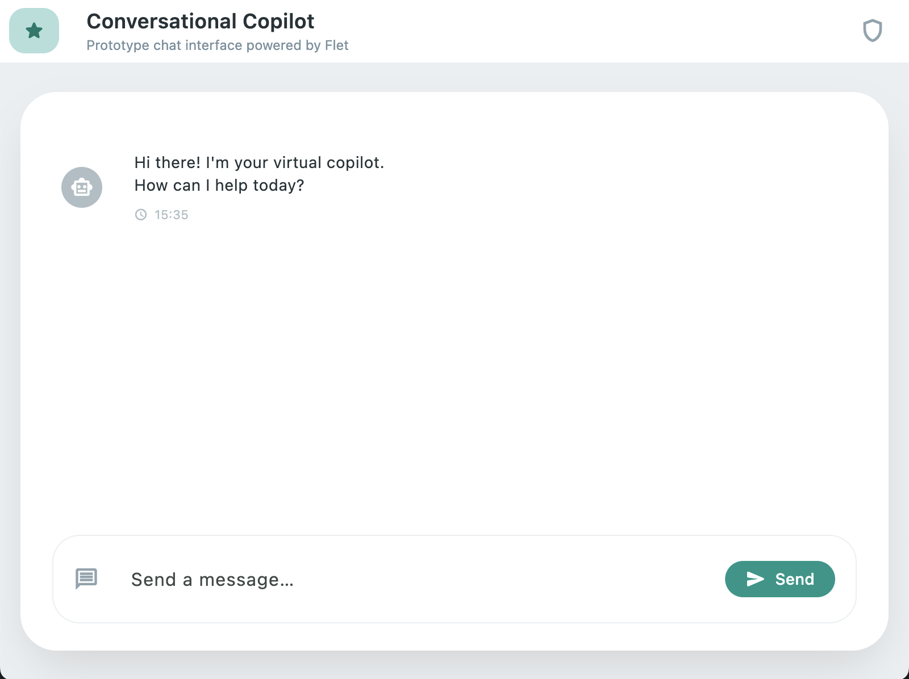

# flet-chatbot

A Simple One-File Prototype chat interface powered by Flet.

Feel free to use this simple app as a starter to build your chatbots with Flet.

## Demo

1. After launching the UI



2. After sending a message


2. Response example with tool invocation


## Features

- Chat input
- Chat conversation UI
- Responsive (Mostly)
- Tool invocation UI from LLM side

## Run the code

```
uv sync
uv run flet src/app.py
```